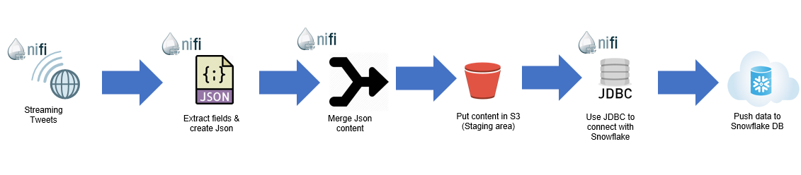

# Real Time Data Ingestion (SnowFlake Db) using NiFi

<b>Project : SnowFlakeDb-NiFi</b> 

<b>Motivation:</b>  
This repository talks about how we can ingest real time data into snowflake using NiFi.

<b>Architecture:</b>  

 

<b>Prequisites:</b>  
1. Create necessary database, schemas and tables in snowflake database. 
Example :  
create database demo; 
use demo; 
create schema tweets; 
create or replace table demo.tweets.userdata (json_data variant); 
 

2. Create a stage backed by S3 (AWS) or Blob Storage (Azure) 
Example :  
CREATE OR REPLACE STAGE "demo"."tweets".STAGE_S3 URL = 's3://sample/testdata/' CREDENTIALS = (AWS_KEY_ID = 'XXXXXXXXXXXXXXXXXXXX' AWS_SECRET_KEY = 'XXXXXXXXXXXXXXXXXXXX') file_format = (TYPE= JSON);  
//For this example we are using json data to ingest into snowflake-db 

3. Now once all this is setup , create a warehouse in Snowflake and place some json files in the above mentioned s3 location and run following command  
copy into demo.tweets.userdata from @STAGE_S3;   
//As soon as this command is run , the snowflake stage will pick all the delta (json files) from s3 and ingest the same into Snowflake. 

4. Now what we need to do it to orchestrate the same with NiFi and we are done. 

